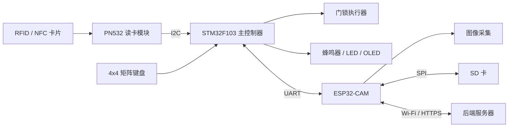

# 基于 STM32 与 ESP32-CAM 的多模态智能门禁系统

本项目是一个面向嵌入式学习与 RFID 课程设计的智能门禁系统。STM32F103 负责 NFC 卡片、矩阵键盘密码认证及本地门禁控制；PN532 负责读取 RFID/NFC 卡片；ESP32-CAM 负责授权卡数据持久化、异常事件拍照、Wi-Fi 通信和后端服务器上传。

系统采用本地控制与联网功能解耦的架构。即使 ESP32-CAM 或网络暂时不可用，STM32 仍可完成基础身份认证；网络恢复后，ESP32-CAM 可继续补传本地保存的异常照片和事件记录。

## 项目目标

- 掌握 RFID/NFC 与 ISO14443A 卡片识别流程
- 掌握 STM32、FreeRTOS、GPIO、I2C、UART 和外设控制
- 实现 NFC 卡片与矩阵键盘密码两种本地认证方式
- 使用 ESP32-CAM 和 SD 卡完成授权数据持久化与异常照片缓存
- 在连续认证失败时自动拍照，并将照片上传至后端服务器
- 实现可靠串口通信、离线补传和异常状态处理
- 形成可复现、可扩展的课程设计开源项目

## 系统架构



STM32 负责实时认证、失败次数统计和门锁控制；ESP32-CAM 负责持久化存储、拍照及联网。两者通过 USART1 通信，ESP32-CAM 故障不应阻塞 STM32 的基础认证流程。

## 当前进度

- [x] 创建 STM32CubeMX + CMake 工程
- [x] STM32F103 系统时钟配置为 72 MHz
- [x] USART2 串口日志输出，115200 8N1
- [x] I2C1 通信，100 kHz
- [x] 扫描并识别 PN532，7 位地址为 `0x24`
- [x] 读取 PN532 固件信息
- [x] 初始化 PN532 SAM 模式
- [x] 识别 ISO14443A 卡片并读取 UID
- [x] 将 PN532 驱动从 `main.c` 拆分为独立模块
- [x] 实现授权卡添加、删除、启用、禁用及身份验证模块
- [x] 为授权卡管理模块编写主机端单元测试
- [x] 接入 4x4 矩阵键盘，实现本地密码认证
- [x] 接入 OLED 和板载 LED，实现认证状态反馈
- [ ] 接入门锁执行器与蜂鸣器
- [ ] 接入 ESP32-CAM
- [ ] 设计并实现 STM32 与 ESP32-CAM 可靠串口协议
- [ ] 将授权 NFC 卡片及门禁事件持久化到 SD 卡
- [ ] 实现连续认证失败 3 次触发拍照与服务器上传
- [ ] 实现断网缓存、联网补传与远程查询

## 硬件清单

| 模块 | 用途 | 当前状态 |
| --- | --- | --- |
| STM32F103C8/CBTx | 主控制器 | 已接入 |
| PN532 | RFID/NFC 读卡 | 已接入 |
| ST-Link | 下载与调试 | 已接入 |
| USB 转串口 | 查看调试日志 | 已接入 |
| 4x4 矩阵键盘 | 密码输入 | 已接入 |
| SSD1306 OLED | 状态与交互显示 | 已接入 |
| 板载 LED | 认证结果反馈 | 已接入 |
| ESP32-CAM | 图像采集与 Wi-Fi 通信 | 计划接入 |
| 继电器、MOSFET 或舵机 | 模拟门锁执行器 | 计划接入 |
| 蜂鸣器 | 声音告警 | 计划接入 |

## 当前接线

### PN532 与 STM32

PN532 需要拨到 I2C 模式。

| PN532 | STM32F103 |
| --- | --- |
| VCC | 3.3V |
| GND | GND |
| SCL | PB6 / I2C1_SCL |
| SDA | PB7 / I2C1_SDA |

PN532 的 7 位 I2C 地址为 `0x24`。STM32 HAL API 使用左移后的地址：

```c
#define PN532_ADDR (0x24 << 1)
```

### 调试串口

| USART2 | STM32F103 |
| --- | --- |
| TX | PA2 |
| RX | PA3 |
| 波特率 | 115200 |

### ESP32-CAM 通信规划

STM32 与 ESP32-CAM 通过 USART1 通信。ESP32-CAM 使用独立电源供电，并与 STM32 共地。

- STM32 将新增或删除的授权卡信息发送给 ESP32-CAM，由 ESP32-CAM 保存至 SD 卡
- 系统启动时，ESP32-CAM 将 SD 卡中的授权卡数据同步给 STM32
- 密码或刷卡连续失败 3 次后，STM32 发送异常拍照指令
- ESP32-CAM 先将照片保存至 SD 卡，再通过 Wi-Fi 上传至后端服务器
- ESP32-CAM 返回数据写入、拍照、上传及网络状态

计划采用带校验和确认机制的二进制数据帧：

```text
帧头 | 协议版本 | 指令类型 | 序列号 | 数据长度 | 数据 | CRC16
```

每条关键指令需要 ACK 确认，并支持超时重发。序列号用于识别重复请求，避免重发导致重复添加卡片或重复拍照。

计划支持的主要指令：

| 指令 | 方向 | 用途 |
| --- | --- | --- |
| `CARD_ADD` / `CARD_REMOVE` | STM32 -> ESP32-CAM | 更新 SD 卡中的授权卡数据 |
| `CARD_SYNC` | ESP32-CAM -> STM32 | 启动时同步授权卡列表 |
| `AUTH_EVENT` | STM32 -> ESP32-CAM | 保存认证事件与结果 |
| `CAPTURE_ALERT` | STM32 -> ESP32-CAM | 触发异常拍照与上传 |
| `STATUS_QUERY` / `STATUS_REPORT` | 双向 | 查询 SD 卡、摄像头和网络状态 |
| `ACK` / `NACK` | 双向 | 确认指令执行结果 |

## ESP32-CAM 后续方案

### 授权数据持久化

- SD 卡保存授权 NFC 卡片及门禁事件，掉电后数据不丢失
- 授权卡记录包含 UID、启用状态、版本号和 CRC 校验
- 优先采用追加式日志或临时文件替换，降低写入过程中掉电导致文件损坏的风险
- STM32 内存保存运行时授权列表；ESP32-CAM 启动后负责向 STM32 同步持久化数据
- SD 卡缺失或同步失败时上报异常，但不阻塞密码认证等本地基础功能

### 异常认证与拍照

STM32 分别统计密码和刷卡失败次数，同时维护全局失败次数。计划规则如下：

1. 在限定时间窗口内累计认证失败 3 次，发送 `CAPTURE_ALERT`。
2. ESP32-CAM 拍照后先保存到 SD 卡，再尝试上传服务器。
3. 服务器确认接收后，将照片标记为已上传。
4. 网络不可用时保留待上传记录，恢复联网后自动补传。
5. 拍照触发后进入冷却时间，避免短时间大量拍照占满 SD 卡。

认证成功后清除失败计数。异常事件记录应包含失败类型、时间戳和卡片 UID 摘要，避免在日志中直接暴露完整敏感信息。

### 安全与可靠性

- 照片与事件通过 HTTPS 上传，并使用设备密钥对请求进行身份校验
- STM32 和 ESP32-CAM 均启用看门狗及串口通信超时处理
- ESP32-CAM 上电、断网、SD 卡写入失败和摄像头失败均需返回明确状态
- 普通 NFC 卡 UID 可被复制，真实使用场景应考虑加密卡或 NFC 卡与密码双因素认证

## 软件与工具

- STM32CubeMX：外设和时钟配置
- Visual Studio Code：代码开发
- CMake：工程构建
- STM32 HAL：底层外设驱动
- ST-Link：程序下载与调试
- ESP-IDF 或 Arduino ESP32：ESP32-CAM 开发，后续确定

当前 STM32 工程使用 CMSIS-RTOS（基于 FreeRTOS）作为调度器，`defaultTask` 负责 PN532 轮询、键盘扫描和认证流程。后续接入 ESP32-CAM 时，计划将串口接收与事件处理拆分为独立任务，并使用消息队列传递认证事件。

## 主要代码目录

```text
door_lock/
├── Core/
│   ├── Inc/
│   │   ├── pn532.h
│   │   ├── access_control.h
│   │   ├── access_config.h
│   │   ├── keypad.h
│   │   ├── ssd1306.h
│   │   └── door_ui.h
│   └── Src/
│       ├── pn532.c
│       ├── access_control.c
│       ├── access_config.c
│       ├── keypad.c
│       ├── ssd1306.c
│       ├── door_ui.c
│       └── main.c
├── Drivers/
├── Middlewares/
├── tests/
│   └── access_control_test.c
├── door_lock.ioc
└── README.md
```

| 模块 | 职责 |
| --- | --- |
| `pn532` | PN532 帧通信、初始化、寻卡和 UID 读取 |
| `access_control` | 授权卡添加、删除、启停及 UID 授权判断 |
| `access_config` | 当前开发阶段的固定密码和授权卡配置 |
| `keypad` | 4x4 矩阵键盘扫描与消抖 |
| `ssd1306` | OLED 底层驱动 |
| `door_ui` | 待机、密码输入和认证结果界面 |
| `tests` | 可在电脑上运行的业务模块单元测试 |

## 门禁工作流程

```text
等待认证
  -> PN532 读取 UID 或矩阵键盘提交密码
  -> STM32 执行本地授权判断
  -> 授权成功：清除失败计数，提示并开门
  -> 授权失败：累计失败次数并拒绝开门
  -> 累计失败达到 3 次：通知 ESP32-CAM 拍照
  -> ESP32-CAM 保存照片并上传，断网时等待补传
  -> 保存门禁事件并恢复等待状态
```

## 开发路线

1. RFID 基础验证：完成 PN532 通信、初始化和 UID 读取。`已完成`
2. 本地认证：完成授权卡管理、矩阵键盘密码、OLED 与 LED 状态反馈。`已完成`
3. 门锁执行：接入门锁执行器、蜂鸣器和失败次数统计。`进行中`
4. 串口与持久化：实现可靠串口协议，将授权卡和门禁事件保存至 ESP32-CAM SD 卡。`计划中`
5. 异常告警：实现连续失败 3 次拍照、服务器上传、断网缓存和联网补传。`计划中`
6. 项目整理：补充原理图、协议文档、测试数据、后端服务和演示视频。`计划中`

## 构建与运行

1. 使用 STM32CubeMX 打开 `door_lock.ioc`。
2. 确认 HSE、I2C1、USART1、USART2 和 Serial Wire 配置。
3. 生成 CMake 工程代码。
4. 使用 VS Code 编译并通过 ST-Link 下载。
5. 打开 USART2 对应的 115200 波特率串口终端。
6. 将 ISO14443A 卡片靠近 PN532，或通过矩阵键盘输入密码并按 `#` 提交。

授权卡当前通过 `Core/Src/access_config.c` 配置；默认密码仅用于开发验证，不应直接用于真实门禁场景。

主机端授权模块测试可单独构建并运行：

```text
cmake -S tests -B build/host-tests-gcc -G "MinGW Makefiles" -DCMAKE_C_COMPILER=gcc
cmake --build build/host-tests-gcc
ctest --test-dir build/host-tests-gcc --output-on-failure
```

当前已验证的串口输出示例：

```text
STM32 start
Found I2C device: 0x24
PN532 OK
SAM OK
Card UID: XX XX XX XX
```

## 开发约定

- 自定义代码应放在 CubeMX 的 `USER CODE BEGIN/END` 区域内
- 外设驱动和业务逻辑逐步从 `main.c` 拆分
- 每增加一个硬件模块，先独立验证，再接入完整流程
- 串口日志使用模块前缀，例如 `[NFC]`、`[AUTH]`、`[DOOR]`
- 不提交构建产物、密钥、Wi-Fi 密码和服务器令牌

## 开源说明

本项目用于 RFID 课程设计、嵌入式学习和功能验证。欢迎提交 Issue、改进建议和 Pull Request。

项目计划采用 MIT License，正式发布前会补充 `LICENSE` 文件。

## 注意事项

- 门锁、继电器和 ESP32-CAM 不应直接由 STM32 GPIO 供电
- ESP32-CAM 峰值电流较大，应使用稳定的独立电源
- 所有模块必须共地
- SD 卡数据不能代替安全备份，重要记录仍应同步至后端服务器
- 本项目是教学演示系统，不建议未经安全加固直接用于真实门禁场景
