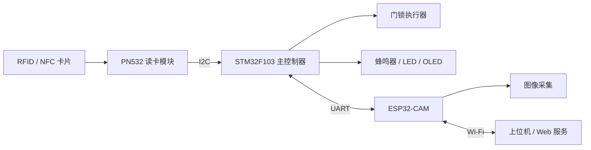

# 基于 STM32、PN532 与 ESP32-CAM 的 RFID 智能门禁系统

本项目是一个面向 RFID 课程设计的开源智能门禁系统。STM32F103 负责 RFID 身份验证和门锁控制，PN532 负责读取 RFID/NFC 卡片，ESP32-CAM 负责现场图像采集、Wi-Fi 通信和后续远程管理功能。

项目当前处于基础功能开发阶段，代码和文档会随着课程设计进度持续完善。

## 项目目标

- 掌握 RFID/NFC 与 ISO14443A 卡片识别流程
- 掌握 STM32 时钟、GPIO、I2C、UART 和外设控制
- 实现卡片 UID 读取、授权判断和门锁控制
- 使用 ESP32-CAM 完成图像采集与网络通信
- 实现门禁记录保存、查询和远程管理
- 形成可复现、可扩展的课程设计开源项目

## 系统架构



STM32 负责实时门禁逻辑，ESP32-CAM 负责图像与网络功能。即使网络不可用，STM32 仍可独立完成本地刷卡开门。

## 当前进度

- [x] 创建 STM32CubeMX + CMake 工程
- [x] STM32F103 系统时钟配置为 72 MHz
- [x] USART2 串口日志输出，115200 8N1
- [x] I2C1 通信，100 kHz
- [x] 扫描并识别 PN532，7 位地址为 `0x24`
- [x] 读取 PN532 固件信息
- [x] 初始化 PN532 SAM 模式
- [x] 识别 ISO14443A 卡片并读取 UID
- [x] 将 PN532 驱动从 `main.c` 拆分为独立模块
- [ ] 实现授权卡列表与身份验证
- [ ] 接入门锁、蜂鸣器、状态灯和 OLED
- [ ] 接入 ESP32-CAM
- [ ] 实现刷卡拍照与门禁记录
- [ ] 实现远程查询与管理

## 硬件清单

| 模块 | 用途 | 当前状态 |
| --- | --- | --- |
| STM32F103C8/CBTx | 主控制器 | 已接入 |
| PN532 | RFID/NFC 读卡 | 已接入 |
| ST-Link | 下载与调试 | 已接入 |
| USB 转串口 | 查看调试日志 | 已接入 |
| ESP32-CAM | 图像采集与 Wi-Fi 通信 | 计划接入 |
| 继电器、MOSFET 或舵机 | 模拟门锁执行器 | 计划接入 |
| 蜂鸣器、LED、OLED | 人机交互 | 计划接入 |

## 当前接线

### PN532 与 STM32

PN532 需要拨到 I2C 模式。

| PN532 | STM32F103 |
| --- | --- |
| VCC | 3.3V |
| GND | GND |
| SCL | PB6 / I2C1_SCL |
| SDA | PB7 / I2C1_SDA |

PN532 的 7 位 I2C 地址为 `0x24`。STM32 HAL API 使用左移后的地址：

```c
#define PN532_ADDR (0x24 << 1)
```

### 调试串口

| USART2 | STM32F103 |
| --- | --- |
| TX | PA2 |
| RX | PA3 |
| 波特率 | 115200 |

### ESP32-CAM 通信规划

STM32 与 ESP32-CAM 通过 USART1 通信。ESP32-CAM 使用独立电源供电，并与 STM32 共地。

- STM32 通知 ESP32-CAM 执行拍照
- STM32 发送刷卡 UID 和验证结果
- ESP32-CAM 返回拍照、上传及网络状态
- ESP32-CAM 接收远程开门或配置命令

## 软件与工具

- STM32CubeMX：外设和时钟配置
- Visual Studio Code：代码开发
- CMake：工程构建
- STM32 HAL：底层外设驱动
- ST-Link：程序下载与调试
- ESP-IDF 或 Arduino ESP32：ESP32-CAM 开发，后续确定

当前 STM32 工程使用 CMSIS-RTOS（基于 FreeRTOS）作为调度器，工程中已包含 `defaultTask` 用于 PN532 启动与读卡。可根据需要调整任务划分与资源管理。

## 目录规划

```text
door_lock/
├── Core/
│   ├── Inc/
│   │   ├── pn532.h
│   │   ├── access_control.h
│   │   ├── door_lock.h
│   │   ├── esp_cam.h
│   │   ├── storage.h
│   │   └── app.h
│   └── Src/
│       ├── pn532.c
│       ├── access_control.c
│       ├── door_lock.c
│       ├── esp_cam.c
│       ├── storage.c
│       ├── app.c
│       └── main.c
├── Drivers/
├── docs/
├── esp32_cam/
├── door_lock.ioc
└── README.md
```

| 模块 | 职责 |
| --- | --- |
| `pn532` | PN532 帧通信、初始化、寻卡和 UID 读取 |
| `access_control` | UID 授权判断与门禁规则 |
| `door_lock` | 门锁、蜂鸣器和状态灯控制 |
| `esp_cam` | STM32 与 ESP32-CAM 通信协议 |
| `storage` | 授权卡和门禁记录持久化 |
| `app` | 应用状态机与模块协调 |

## 门禁工作流程

```text
等待刷卡
  -> PN532 读取 UID
  -> 查询本地授权列表
  -> ESP32-CAM 拍照并记录事件
  -> 授权成功：提示并开门
  -> 授权失败：提示并拒绝开门
  -> 保存门禁记录
  -> 恢复等待状态
```

## 开发路线

1. RFID 基础验证：完成 PN532 通信、初始化和 UID 读取。
2. 本地门禁：拆分驱动、建立授权列表、控制门锁和声光提示。
3. 显示与存储：接入 OLED，保存授权卡和门禁记录。
4. ESP32-CAM：实现刷卡拍照、记录上传和远程控制。
5. 课程设计整理：补充原理图、流程图、测试数据、报告和演示视频。

## 构建与运行

1. 使用 STM32CubeMX 打开 `door_lock.ioc`。
2. 确认 HSE、I2C1、USART1、USART2 和 Serial Wire 配置。
3. 生成 CMake 工程代码。
4. 使用 VS Code 编译并通过 ST-Link 下载。
5. 打开 USART2 对应的 115200 波特率串口终端。
6. 将 ISO14443A 卡片靠近 PN532，查看 UID 输出。

当前已验证的串口输出示例：

```text
STM32 start
Found I2C device: 0x24
PN532 OK
SAM OK
Card UID: XX XX XX XX
```

## 开发约定

- 自定义代码应放在 CubeMX 的 `USER CODE BEGIN/END` 区域内
- 外设驱动和业务逻辑逐步从 `main.c` 拆分
- 每增加一个硬件模块，先独立验证，再接入完整流程
- 串口日志使用模块前缀，例如 `[NFC]`、`[AUTH]`、`[DOOR]`
- 不提交构建产物、密钥、Wi-Fi 密码和服务器令牌

## 开源说明

本项目用于 RFID 课程设计、嵌入式学习和功能验证。欢迎提交 Issue、改进建议和 Pull Request。

项目计划采用 MIT License，正式发布前会补充 `LICENSE` 文件。

## 注意事项

- 门锁、继电器和 ESP32-CAM 不应直接由 STM32 GPIO 供电
- ESP32-CAM 峰值电流较大，应使用稳定的独立电源
- 所有模块必须共地
- 本项目是教学演示系统，不建议未经安全加固直接用于真实门禁场景