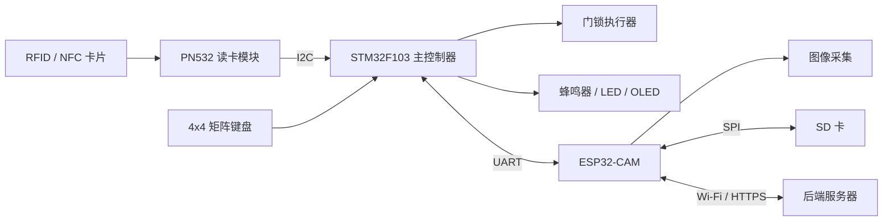

# 基于 STM32 与 ESP32-CAM 的多模态智能门禁系统

本项目是一个面向嵌入式学习与 RFID 课程设计的智能门禁系统。STM32F103 负责 NFC 卡片、矩阵键盘密码认证及本地门禁控制；PN532 负责读取 RFID/NFC 卡片；ESP32-CAM 负责授权卡数据持久化、异常事件拍照、Wi-Fi 通信和后端服务器上传。

系统采用本地控制与联网功能解耦的架构。即使 ESP32-CAM 或网络暂时不可用，STM32 仍可完成基础身份认证；网络恢复后，ESP32-CAM 可继续补传本地保存的异常照片和事件记录。

## 项目目标

- 掌握 RFID/NFC 与 ISO14443A 卡片识别流程
- 掌握 STM32、FreeRTOS、GPIO、I2C、UART 和外设控制
- 实现 NFC 卡片与矩阵键盘密码两种本地认证方式
- 使用 ESP32-CAM 和 SD 卡完成授权数据持久化与异常照片缓存
- 在连续认证失败时自动拍照，并将照片上传至后端服务器
- 实现可靠串口通信、离线补传和异常状态处理
- 形成可复现、可扩展的课程设计开源项目

## 系统架构



STM32 负责实时认证、失败次数统计和门锁控制；ESP32-CAM 负责持久化存储、拍照及联网。两者通过 USART1 通信，ESP32-CAM 故障不应阻塞 STM32 的基础认证流程。

## 当前进度

- [x] 创建 STM32CubeMX + CMake 工程
- [x] STM32F103 系统时钟配置为 72 MHz
- [x] USART2 串口日志输出，115200 8N1
- [x] I2C1 通信，100 kHz
- [x] 扫描并识别 PN532，7 位地址为 `0x24`
- [x] 读取 PN532 固件信息
- [x] 初始化 PN532 SAM 模式
- [x] 识别 ISO14443A 卡片并读取 UID
- [x] 将 PN532 驱动从 `main.c` 拆分为独立模块
- [x] 实现授权卡添加、删除、启用、禁用及身份验证模块
- [x] 接入 4x4 矩阵键盘，实现本地密码认证
- [x] 接入 OLED 和板载 LED，实现认证状态反馈
- [x] 接入蜂鸣器反馈，并预留门锁执行器 GPIO 控制代码
- [x] 接入 ESP32-CAM 串口链路（STM32 端 USART1）
- [x] 设计并实现 STM32 与 ESP32-CAM 二进制串口协议、CRC16、ACK/NACK 和超时重发
- [x] 将本地认证事件通过 `AUTH_EVENT` 发送给 ESP32-CAM
- [x] 实现连续认证失败 3 次触发 `CAPTURE_ALERT`，带 30 秒冷却
- [ ] 将授权 NFC 卡片持久化到 ESP32-CAM SD 卡并在启动时同步
- [ ] 实现照片保存到 SD 卡、HTTPS 上传、断网缓存和联网补传

## 硬件清单

| 模块 | 用途 | 当前状态 |
| --- | --- | --- |
| STM32F103C8/CBTx | 主控制器 | 已接入 |
| PN532 | RFID/NFC 读卡 | 已接入 |
| ST-Link | 下载与调试 | 已接入 |
| USB 转串口 | 查看调试日志 | 已接入 |
| 4x4 矩阵键盘 | 密码输入 | 已接入 |
| SSD1306 OLED | 状态与交互显示 | 已接入 |
| 板载 LED | 认证结果反馈 | 已接入 |
| ESP32-CAM | 图像采集、拍照和 Wi-Fi 通信 | 串口协议与拍照触发代码已接入 |
| 继电器、MOSFET 或舵机 | 模拟门锁执行器 | 代码已预留，需手动配置锁控 GPIO |
| 蜂鸣器 | 声音告警 | 已接入 PA8 / `BEEF_Pin` |

## 当前接线

### PN532 与 STM32

PN532 需要拨到 I2C 模式。

| PN532 | STM32F103 |
| --- | --- |
| VCC | 3.3V |
| GND | GND |
| SCL | PB6 / I2C1_SCL |
| SDA | PB7 / I2C1_SDA |

PN532 的 7 位 I2C 地址为 `0x24`。STM32 HAL API 使用左移后的地址：

```c
#define PN532_ADDR (0x24 << 1)
```

### 调试串口

| USART2 | STM32F103 |
| --- | --- |
| TX | PA2 |
| RX | PA3 |
| 波特率 | 115200 |

### 蜂鸣器与门锁执行器

蜂鸣器当前使用 CubeMX 已生成的 `BEEF_Pin`（PA8），默认按高电平有效处理。如果你的蜂鸣器模块是低电平触发，修改 `Core/Src/door_hardware.c` 中的 `DOOR_BUZZER_ACTIVE_STATE`。

门锁执行器代码已经预留，但当前 `main.h` 中还没有独立锁控引脚。需要在 CubeMX 中手动新增一个 GPIO Output，并把 User Label 命名为 `DOOR_LOCK` 或 `LOCK`。代码会自动识别 `DOOR_LOCK_Pin` / `DOOR_LOCK_GPIO_Port` 或 `LOCK_Pin` / `LOCK_GPIO_Port`。

门锁、继电器、MOSFET 或舵机不能由 STM32 GPIO 直接供电；GPIO 只负责控制驱动级。默认开锁输出为高电平有效，如果你的驱动相反，修改 `DOOR_LOCK_ACTIVE_STATE`。

### ESP32-CAM 通信与协议

STM32 与 ESP32-CAM 通过 USART1 通信。ESP32-CAM 使用独立电源供电，并与 STM32 共地。

| STM32F103 | ESP32-CAM 默认代码 | 说明 |
| --- | --- | --- |
| PA9 / USART1_TX | GPIO13 / UART1_RX | STM32 发送到 ESP32 |
| PA10 / USART1_RX | GPIO14 / UART1_TX | ESP32 发送到 STM32 |
| GND | GND | 必须共地 |

ESP32 默认引脚在 `D:\esp32_project\smart_lock_camera\main\main.c` 的 `STM32_UART_TX_GPIO` 和 `STM32_UART_RX_GPIO` 中配置。AI-Thinker ESP32-CAM 的 GPIO13/14 会与 SD 卡 4-bit 接线冲突；后续启用 SD 卡时，需要换 UART 引脚，或改用 UART0 并处理下载/日志串口占用。

已实现的链路能力：

- STM32 端：`smart_lock_protocol` 负责帧编解码和 CRC16；`esp32_link` 负责 USART1、发送队列、ACK/NACK、350 ms 超时和最多 3 次重发。
- ESP32 端：解析同一套协议，处理 `HELLO`、`STATUS_QUERY`、`AUTH_EVENT` 和 `CAPTURE_ALERT`；收到拍照告警后调用 `esp_camera_fb_get()` 抓取 JPEG 帧。
- 认证成功会清零连续失败计数；认证失败累计到 3 次后发送 `CAPTURE_ALERT`，随后进入 30 秒冷却。

帧格式如下，所有多字节字段均为小端：

```text
0xA5 0x5A | version=0x01 | type | sequence | payload_length(u16) | payload | crc16(u16)
```

CRC16 使用 CCITT-FALSE 形式：初值 `0xFFFF`，多项式 `0x1021`，计算范围为 `version` 到 `payload`，不包含两个帧头字节。当前最大 payload 为 48 字节。

| 指令 | 值 | 方向 | 当前状态 | 用途 |
| --- | --- | --- | --- | --- |
| `ACK` | `0x01` | 双向 | 已实现 | 确认收到并接受帧 |
| `NACK` | `0x02` | 双向 | 已实现 | 返回不支持或 payload 错误 |
| `HELLO` | `0x10` | 双向 | 已实现 | 上电握手 |
| `STATUS_QUERY` | `0x11` | STM32 -> ESP32 | 已实现 | 查询 ESP32 状态 |
| `STATUS_REPORT` | `0x12` | ESP32 -> STM32 | 已实现 | bit0 表示摄像头可用，bit1/bit2 预留给 SD/网络 |
| `CARD_ADD` / `CARD_REMOVE` | `0x20` / `0x21` | STM32 -> ESP32 | 预留 | 更新 SD 卡中的授权卡数据 |
| `CARD_SYNC` | `0x22` | ESP32 -> STM32 | 预留 | 启动时同步授权卡列表 |
| `AUTH_EVENT` | `0x30` | STM32 -> ESP32 | 已实现 | 保存或打印认证事件 |
| `CAPTURE_ALERT` | `0x31` | STM32 -> ESP32 | 已实现 | 触发异常拍照 |

`AUTH_EVENT` payload：

```text
method(1) | result(1) | failure_count(1) | uid_len(1) | stm32_tick_ms(u32) | uid(uid_len)
```

`method`：`1` 表示密码，`2` 表示 NFC；`result`：`0` 表示拒绝，`1` 表示授权。

`CAPTURE_ALERT` payload：

```text
reason(1) | failure_count(1) | uid_len(1) | reserved(1) | stm32_tick_ms(u32) | uid(uid_len)
```

当前 `reason=1` 表示连续失败达到阈值。
## ESP32-CAM 后续方案

### 授权数据持久化

- SD 卡保存授权 NFC 卡片及门禁事件，掉电后数据不丢失
- 授权卡记录包含 UID、启用状态、版本号和 CRC 校验
- 优先采用追加式日志或临时文件替换，降低写入过程中掉电导致文件损坏的风险
- STM32 内存保存运行时授权列表；ESP32-CAM 启动后负责向 STM32 同步持久化数据
- SD 卡缺失或同步失败时上报异常，但不阻塞密码认证等本地基础功能

### 异常认证与拍照

STM32 当前维护一个全局连续失败计数，密码和刷卡失败都会累加。当前规则如下：

1. 连续认证失败达到 3 次，发送 `CAPTURE_ALERT`。
2. ESP32-CAM 拍照后先保存到 SD 卡，再尝试上传服务器。
3. 服务器确认接收后，将照片标记为已上传。
4. 网络不可用时保留待上传记录，恢复联网后自动补传。
5. 拍照触发后进入 30 秒冷却时间，避免短时间大量拍照占满存储。

认证成功后清除失败计数。异常事件记录应包含失败类型、时间戳和卡片 UID 摘要，避免在日志中直接暴露完整敏感信息。

### 安全与可靠性

- 照片与事件通过 HTTPS 上传，并使用设备密钥对请求进行身份校验
- STM32 和 ESP32-CAM 均启用看门狗及串口通信超时处理
- ESP32-CAM 上电、断网、SD 卡写入失败和摄像头失败均需返回明确状态
- 普通 NFC 卡 UID 可被复制，真实使用场景应考虑加密卡或 NFC 卡与密码双因素认证

## 软件与工具

- STM32CubeMX：外设和时钟配置
- Visual Studio Code：代码开发
- CMake：工程构建
- STM32 HAL：底层外设驱动
- ST-Link：程序下载与调试
- ESP-IDF v6.0.1：ESP32-CAM 开发与构建

当前 STM32 工程使用 CMSIS-RTOS（基于 FreeRTOS）作为调度器，`defaultTask` 负责 PN532 轮询、键盘扫描、认证流程和 ESP32 串口链路轮询。ESP32 事件发送已经做成队列和 ACK 重发，后续如果业务继续变复杂，可再拆成独立任务。

## 主要代码目录

```text
door_lock/
├── Core/
│   ├── Inc/
│   │   ├── pn532.h
│   │   ├── access_control.h
│   │   ├── access_config.h
│   │   ├── smart_lock_protocol.h
│   │   ├── esp32_link.h
│   │   ├── door_hardware.h
│   │   ├── keypad.h
│   │   ├── ssd1306.h
│   │   └── door_ui.h
│   └── Src/
│       ├── pn532.c
│       ├── access_control.c
│       ├── access_config.c
│       ├── smart_lock_protocol.c
│       ├── esp32_link.c
│       ├── door_hardware.c
│       ├── keypad.c
│       ├── ssd1306.c
│       ├── door_ui.c
│       └── main.c
├── Drivers/
├── Middlewares/
├── door_lock.ioc
└── README.md
```

| 模块 | 职责 |
| --- | --- |
| `pn532` | PN532 帧通信、初始化、寻卡和 UID 读取 |
| `access_control` | 授权卡添加、删除、启停及 UID 授权判断 |
| `access_config` | 当前开发阶段的固定密码和授权卡配置 |
| `smart_lock_protocol` | STM32/ESP32 二进制帧、CRC16 和解码状态机 |
| `esp32_link` | STM32 USART1 链路、发送队列、ACK/NACK 和重发 |
| `door_hardware` | 蜂鸣器反馈和可选门锁 GPIO 控制 |
| `keypad` | 4x4 矩阵键盘扫描与消抖 |
| `ssd1306` | OLED 底层驱动 |
| `door_ui` | 待机、密码输入和认证结果界面 |

## 门禁工作流程

```text
等待认证
  -> PN532 读取 UID 或矩阵键盘提交密码
  -> STM32 执行本地授权判断
  -> 授权成功：清除失败计数，提示并开门
  -> 授权失败：累计失败次数并拒绝开门
  -> 累计失败达到 3 次：通知 ESP32-CAM 拍照
  -> ESP32-CAM 保存照片并上传，断网时等待补传
  -> 保存门禁事件并恢复等待状态
```

## 开发路线

1. RFID 基础验证：完成 PN532 通信、初始化和 UID 读取。`已完成`
2. 本地认证：完成授权卡管理、矩阵键盘密码、OLED 与 LED 状态反馈。`已完成`
3. 门锁执行：蜂鸣器和失败次数统计已完成；门锁 GPIO 控制代码已预留，需 CubeMX 手动配置锁控引脚。`进行中`
4. 串口与持久化：可靠串口协议、认证事件和拍照告警已完成；授权卡/事件 SD 卡持久化待实现。`进行中`
5. 异常告警：连续失败 3 次触发 ESP32-CAM 拍照已完成；照片保存、服务器上传、断网缓存和联网补传待实现。`进行中`
6. 项目整理：补充原理图、协议文档、演示数据、后端服务和演示视频。`计划中`

## CubeMX 手动配置清单

以下事项属于 CubeMX 或硬件接线层面，我没有在代码里强行修改生成配置：

1. `USART1` 保持异步串口，115200 8N1；PA9 为 TX，PA10 为 RX，用于连接 ESP32-CAM。
2. `USART2` 保持 115200 8N1，用于日志输出。
3. `BEEF_Pin` 当前已由 CubeMX 生成为 PA8 输出，可直接接蜂鸣器驱动模块。
4. 门锁执行器需要新增一个 GPIO Output，User Label 命名为 `DOOR_LOCK` 或 `LOCK`；代码会自动识别这两种命名。
5. 如果接入真实继电器、MOSFET 或舵机，必须外接驱动和独立供电，STM32 GPIO 只接控制端。
6. 如果运行后出现任务栈不足或异常复位，把 CubeMX 里的 `defaultTask` stack size 从当前 256 words 提高到 512 words。
7. 每次重新生成 CubeMX 代码后，检查顶层 `CMakeLists.txt` 是否仍包含 `smart_lock_protocol.c`、`esp32_link.c` 和 `door_hardware.c`。

ESP32-CAM 端默认 UART1 使用 GPIO14(TX) 和 GPIO13(RX)。如果你要启用 SD 卡，GPIO13/14 可能与 SD 卡接线冲突，需要先调整 `D:\esp32_project\smart_lock_camera\main\main.c` 顶部的 `STM32_UART_TX_GPIO` / `STM32_UART_RX_GPIO`。

## 构建与运行

1. 使用 STM32CubeMX 打开 `door_lock.ioc`。
2. 确认 HSE、I2C1、USART1、USART2 和 Serial Wire 配置。
3. 生成 CMake 工程代码。
4. 使用 VS Code 编译并通过 ST-Link 下载。
5. 打开 USART2 对应的 115200 波特率串口终端。
6. 将 ISO14443A 卡片靠近 PN532，或通过矩阵键盘输入密码并按 `#` 提交。

授权卡当前通过 `Core/Src/access_config.c` 配置；默认密码仅用于开发验证，不应直接用于真实门禁场景。

STM32 固件构建：

```text
"C:\Program Files\CMake\bin\cmake.exe" --build build/Debug
```

ESP32-CAM 构建需要先加载 ESP-IDF 环境：

```powershell
. "C:\Espressif\tools\Microsoft.v6.0.1.PowerShell_profile.ps1"
idf.py -C "D:\esp32_project\smart_lock_camera" build
```

当前已验证的串口输出示例：

```text
STM32 start
Found I2C device: 0x24
PN532 OK
SAM OK
Card UID: XX XX XX XX
```

## 开发约定

- 自定义代码应放在 CubeMX 的 `USER CODE BEGIN/END` 区域内
- 外设驱动和业务逻辑逐步从 `main.c` 拆分
- 每增加一个硬件模块，先独立验证，再接入完整流程
- 串口日志使用模块前缀，例如 `[NFC]`、`[AUTH]`、`[DOOR]`
- 不提交构建产物、密钥、Wi-Fi 密码和服务器令牌

## 开源说明

本项目用于 RFID 课程设计、嵌入式学习和功能验证。欢迎提交 Issue、改进建议和 Pull Request。

项目计划采用 MIT License，正式发布前会补充 `LICENSE` 文件。

## 注意事项

- 门锁、继电器和 ESP32-CAM 不应直接由 STM32 GPIO 供电
- ESP32-CAM 峰值电流较大，应使用稳定的独立电源
- 所有模块必须共地
- SD 卡数据不能代替安全备份，重要记录仍应同步至后端服务器
- 本项目是教学演示系统，不建议未经安全加固直接用于真实门禁场景
